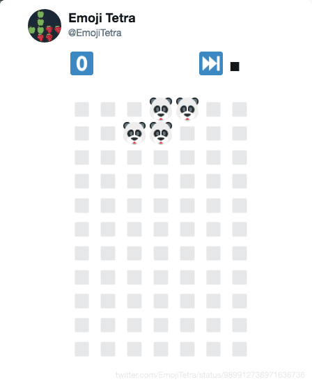

# EmojiTetra gif generator

Generates a gif of the MMO Tetra game hosted by [@EmjoiTetra](https://twitter.com/EmjoiTetra):



## Setup

Requirements:

- [gifski cli](https://gif.ski/) to be installed and in the PATH
- Node.js >= 10.0.0
- [`yarn`](https://yarnpkg.com/en/)

Installation:

```
$ git clone https://github.com/jesstelford/emoji-tetra-animated.git
$ cd emoji-tetra-animated
$ yarn
```

## Running it

```
$ node index.js 989912736971636736
```

_(where `989912736971636736` is the ID of the first tweet in a game thread)_

Will give output like:

```
❯ node index.js
✔ Setting up Headless Chrome
✔ Saved screenshot for tweet 989912736971636736
...
✔ Saved screenshot for tweet 990617375895470080
✔ All screenshots taken
✔ Done!
```

And will create an optimized gif animation, saved as **`anim.gif`**.
